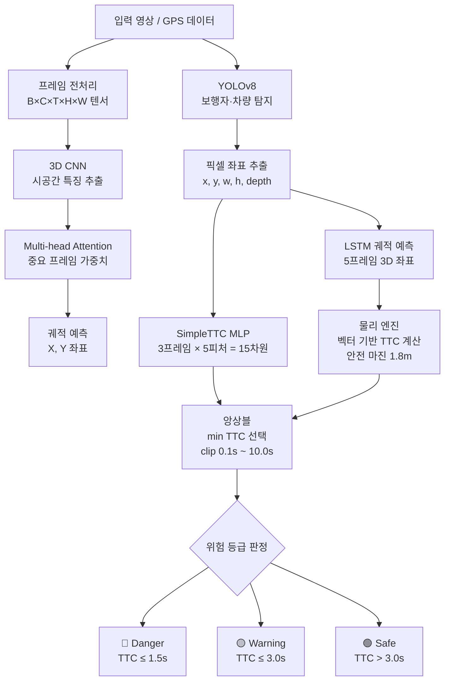
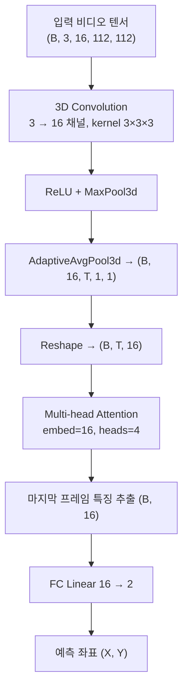
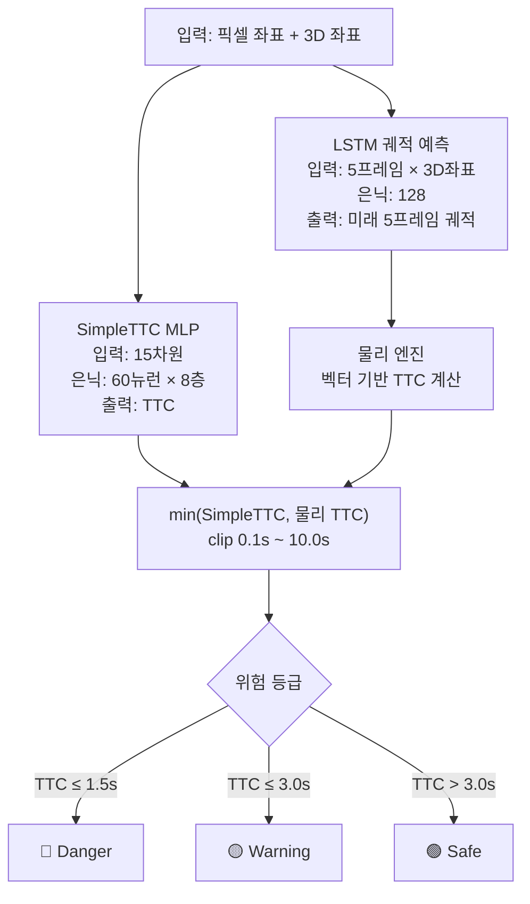

# 이미지 및 GPS 데이터 기반 이동체 경로 예측 및 충돌 예측 연구

Trajectory Prediction and Collision Prediction based on Image & GPS Data

YOLOv8 보행자 탐지, 3D CNN + Attention, LSTM 궤적 예측, SimpleTTC MLP를 결합한 딥러닝 기반 실시간 TTC(Time-To-Collision) 분석 시스템입니다.  
nuScenes / KITTI / ETH·UCY 데이터셋을 지원하며, Streamlit 대시보드를 통해 실시간 시각화를 제공합니다.

---

## 프로젝트 구조

```
trajectory-prediction/
├── app/                        # 초기 파이프라인 (3D CNN 기반)
│   ├── main.py                 # FastAPI 엔드포인트
│   ├── model.py                # 3D CNN + Attention 모델
│   ├── detector.py             # YOLOv8 보행자 탐지
│   ├── inference.py            # 추론 파이프라인
│   ├── preprocess.py           # 영상 프레임 전처리
│   ├── dataset.py              # 데이터셋 로더
│   └── train.py                # 모델 학습
│
├── src/                        # 고도화 파이프라인 (TTC 예측 기반)
│   ├── main.py                 # FastAPI 엔드포인트 (Safe-AI API, port 8888)
│   ├── inference_engine.py     # SimpleTTC + LSTM 통합 추론 엔진
│   ├── app_ui.py               # Streamlit 실시간 대시보드
│   ├── train_lstm.py           # LSTM 모델 학습
│   ├── train_cnn3d.py          # 3D CNN 모델 학습
│   ├── train_simple_ttc.py     # SimpleTTC 모델 학습
│   ├── train_simple_ttc_v2.py  # SimpleTTC v2 학습
│   ├── visualize.py            # 궤적 시각화
│   ├── visualize_sgan.py       # ETH/UCY 궤적 시각화
│   ├── test_integration.py     # 통합 테스트
│   ├── predictors/
│   │   ├── simple_ttc.py       # SimpleTTC MLP (픽셀 기반 TTC 직접 예측)
│   │   ├── lstm_predictor.py   # LSTM 3D 궤적 예측 모델
│   │   └── cnn3d_predictor.py  # 3D CNN 예측 모델
│   ├── pipeline/
│   │   └── queue_pipeline.py   # 비동기 큐 기반 파이프라인
│   └── utils/
│       ├── base_parser.py      # 공통 파서 베이스 클래스
│       ├── dataset.py          # 기본 데이터셋 처리
│       ├── lstm_dataset.py     # LSTM 학습용 데이터셋
│       ├── cnn3d_dataset.py    # 3D CNN 학습용 데이터셋
│       ├── data_helper.py      # 데이터 전처리 헬퍼
│       ├── kitti_parser.py     # KITTI 데이터셋 파서
│       ├── sgan_parser.py      # ETH/UCY 데이터셋 파서
│       ├── nuscenes_parser.py  # nuScenes 데이터셋 파서
│       └── physics_engine.py   # 벡터 기반 TTC 물리 계산
│
├── models/                     # 학습된 모델 및 스케일러 파일
├── Dockerfile
├── docker-compose.yml
└── requirements.txt
```

---

## 모델 아키텍처

### 시스템 전체 파이프라인



### 1. 3D CNN + Attention 모델 (app/)



### 2. TTC 앙상블 추론 구조 (src/)



### TTC 위험 등급 기준 (기본값, UI에서 조정 가능)

| TTC 범위 | 위험 등급 |
|----------|----------|
| ≤ 1.5초 | 🔴 **Danger** |
| 1.5 ~ 3.0초 | 🟡 **Warning** |
| > 3.0초 | 🟢 **Safe** |

---

## 지원 데이터셋

| 데이터셋 | 설명 | 파서 |
|---------|------|------|
| **nuScenes** | 자율주행 멀티센서 데이터 (v1.0-mini) | `nuscenes_parser.py` |
| **KITTI** | 도로 주행 라이다·카메라 데이터 | `kitti_parser.py` |
| **ETH/UCY** | 보행자 궤적 공개 데이터셋 (SGAN 포맷) | `sgan_parser.py` |

---

## Streamlit 대시보드

실시간 시뮬레이션 UI로 GPS Map View + Camera View를 동시에 표시합니다.

**주요 기능**
- 데이터셋 선택: nuScenes / ETH·UCY / KITTI
- TTC 임계값 슬라이더 실시간 조정
- Frame Skip / Frame Delay 속도 제어
- ▶️ 시작 / ⏹️ 정지 / ⏩ 재개 시뮬레이션 제어
- 하단 위험 등급별 객체 수 및 TTC 카드 (Danger / Warning / Safe)
- KST 기준 위험 감지 로그 기록

```bash
streamlit run src/app_ui.py --server.port 8501 --server.address 0.0.0.0
```

---

## API 엔드포인트

### app/ 서버 (3D CNN 기반, port 8000)
```bash
uvicorn app.main:app --host 0.0.0.0 --port 8000
```

| 메서드 | 경로 | 설명 |
|--------|------|------|
| GET | `/` | 서버 상태 확인 |
| GET | `/health` | 디바이스 정보 확인 |
| POST | `/predict` | 영상 경로로 궤적 예측 |

### src/ 서버 (TTC 앙상블 기반, port 8888)
```bash
uvicorn src.main:app --host 0.0.0.0 --port 8888
```

| 메서드 | 경로 | 설명 |
|--------|------|------|
| POST | `/predict` | TTC 및 위험 등급 예측 |

```json
// POST /predict 요청
{
  "history_pix": [[x, y, w, h, depth], ...],
  "history_3d":  [[x, y, depth], ...]
}

// 응답
{ "ttc": 1.32, "status": "Danger" }
```

---

## 실행 방법

### 로컬 실행
```bash
pip install -r requirements.txt

# Streamlit 대시보드
streamlit run src/app_ui.py --server.port 8501 --server.address 0.0.0.0

# src/ API 서버
uvicorn src.main:app --host 0.0.0.0 --port 8888

# app/ API 서버
uvicorn app.main:app --host 0.0.0.0 --port 8000
```

### Docker 실행
```bash
docker build -t trajectory-api .
docker run -p 8888:8888 trajectory-api

# 또는 docker-compose
docker-compose up --build
```

---

## 기술 스택

| 분류 | 기술 |
|------|------|
| 언어 | Python 3.x |
| 딥러닝 | PyTorch |
| 객체 탐지 | YOLOv8 (Ultralytics) |
| API 서버 | FastAPI, Uvicorn |
| 대시보드 | Streamlit, Plotly |
| 데이터 처리 | NumPy, Pandas, scikit-learn, OpenCV |
| 이미지 처리 | Pillow, pyquaternion |
| 배포 | Docker, docker-compose |
