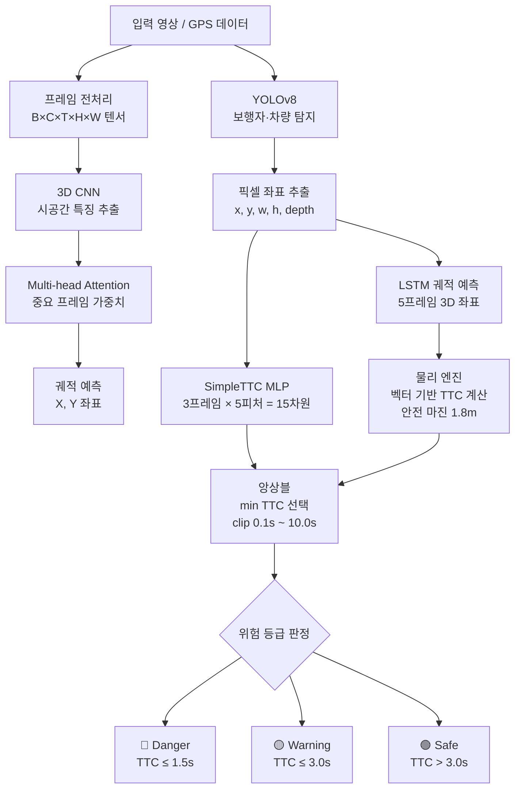
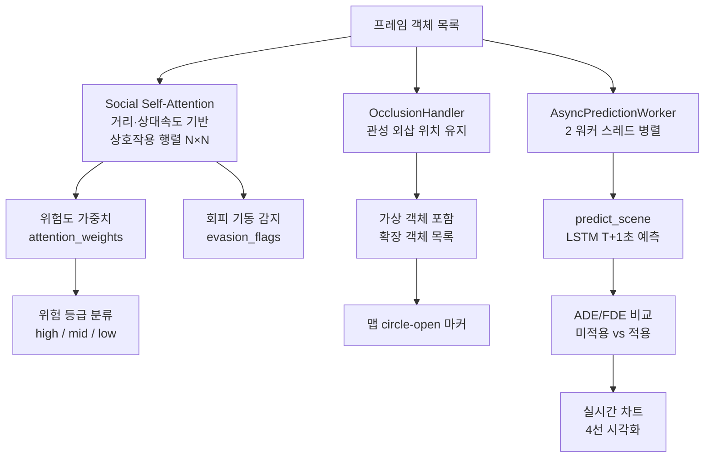
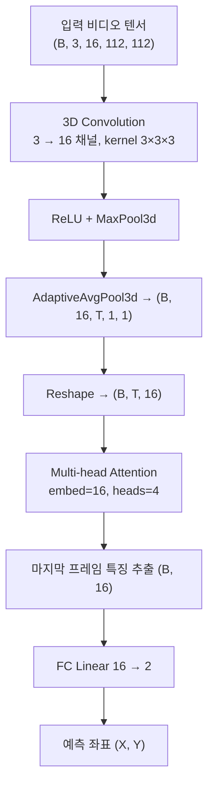
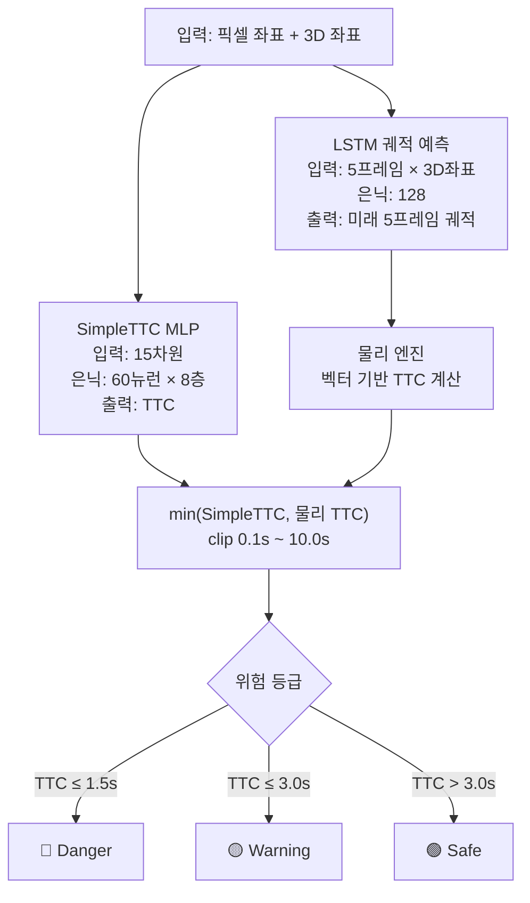

# 이미지 및 GPS 데이터 기반 이동체 경로 예측 및 충돌 예측 연구

Trajectory Prediction and Collision Prediction based on Image & GPS Data

YOLOv8 보행자 탐지, 3D CNN + Attention, LSTM 궤적 예측, SimpleTTC MLP를 결합한 딥러닝 기반 실시간 TTC(Time-To-Collision) 분석 시스템입니다.  
nuScenes / KITTI / ETH·UCY 데이터셋을 지원하며, Streamlit 대시보드를 통해 실시간 시각화를 제공합니다.

---

## 프로젝트 구조

```
trajectory-prediction/
├── app/                        # 초기 파이프라인 (3D CNN 기반)
│   ├── main.py                 # FastAPI 엔드포인트
│   ├── model.py                # 3D CNN + Attention 모델
│   ├── detector.py             # YOLOv8 보행자 탐지
│   ├── inference.py            # 추론 파이프라인
│   ├── preprocess.py           # 영상 프레임 전처리
│   ├── dataset.py              # 데이터셋 로더
│   └── train.py                # 모델 학습
│
├── src/                        # 고도화 파이프라인 (TTC 예측 기반)
│   ├── main.py                 # FastAPI 엔드포인트 (Safe-AI API, port 8888)
│   ├── inference_engine.py     # SimpleTTC + LSTM + Social Attention 통합 추론 엔진
│   ├── app_ui.py               # Streamlit 실시간 대시보드 (Sprint 2 기능 포함)
│   ├── train_lstm.py           # LSTM 모델 학습
│   ├── train_cnn3d.py          # 3D CNN 모델 학습
│   ├── train_simple_ttc.py     # SimpleTTC 모델 학습
│   ├── train_simple_ttc_v2.py  # SimpleTTC v2 학습
│   ├── visualize.py            # 궤적 시각화
│   ├── visualize_sgan.py       # ETH/UCY 궤적 시각화
│   ├── test_integration.py     # 통합 테스트
│   ├── predictors/
│   │   ├── simple_ttc.py       # SimpleTTC MLP (픽셀 기반 TTC 직접 예측)
│   │   ├── lstm_predictor.py   # LSTM 3D 궤적 예측 모델
│   │   ├── cnn3d_predictor.py  # 3D CNN 예측 모델
│   │   └── social_attention.py # Social Self-Attention 모듈 (Sprint 2)
│   ├── pipeline/
│   │   └── queue_pipeline.py   # 비동기 큐 기반 파이프라인
│   └── utils/
│       ├── base_parser.py      # 공통 파서 베이스 클래스
│       ├── dataset.py          # 기본 데이터셋 처리
│       ├── lstm_dataset.py     # LSTM 학습용 데이터셋
│       ├── cnn3d_dataset.py    # 3D CNN 학습용 데이터셋
│       ├── data_helper.py      # 데이터 전처리 헬퍼
│       ├── kitti_parser.py     # KITTI 데이터셋 파서
│       ├── sgan_parser.py      # ETH/UCY 데이터셋 파서
│       ├── nuscenes_parser.py  # nuScenes 데이터셋 파서
│       ├── physics_engine.py   # 벡터 기반 TTC 물리 계산
│       ├── occlusion_handler.py    # Occlusion 대응 관성 예측 모듈 (Sprint 2)
│       ├── async_worker.py         # 비동기 예측 워커 (Sprint 2)
│       ├── validate_occlusion.py   # T12 Occlusion 전/후 예측 적중률 검증
│       └── validate_performance.py # T15/T18 레이턴시·FPS 성능 검증
│
├── models/                     # 학습된 모델 및 스케일러 파일
├── Dockerfile
├── docker-compose.yml
└── requirements.txt
```

---

## 모델 아키텍처

### 시스템 전체 파이프라인



### Sprint 2 확장 파이프라인



### 1. 3D CNN + Attention 모델 (app/)



### 2. TTC 앙상블 추론 구조 (src/)



### TTC 위험 등급 기준 (기본값, UI에서 조정 가능)

| TTC 범위 | 위험 등급 |
|----------|----------|
| ≤ 1.5초 | 🔴 **Danger** |
| 1.5 ~ 3.0초 | 🟡 **Warning** |
| > 3.0초 | 🟢 **Safe** |

---

## Sprint 2 기능 (Social Attention · Occlusion · 비동기 엔진)

### Social Self-Attention 모듈 (`predictors/social_attention.py`)

다중 객체 간 상호작용을 물리 기반으로 모델링합니다.

| 기능 | 설명 |
|------|------|
| 위험도 점수 | 자차 기준 거리 역수 + 접근 속도로 위험 점수 산출 |
| 어텐션 가중치 | Softmax 정규화 → 객체별 위험 가중치 |
| 상호작용 행렬 | N×N 행렬 — 거리·상대속도 기반, 행별 정규화 |
| 회피 기동 감지 | 횡방향 속도 비율 > 20% + 인접 객체 영향력 > 35% |
| 위험 등급 | `high` / `mid` / `low` 3단계 분류 |

### Occlusion Handler (`utils/occlusion_handler.py`)

객체가 프레임에서 사라질 때 등속 운동 가정으로 위치를 유지합니다.

| 기능 | 설명 |
|------|------|
| 관성 외삽 | 마지막 속도 벡터로 매 프레임 위치 추정 |
| 최대 유지 | 기본 10프레임까지 가상 객체 유지 후 삭제 |
| 재등장 오차 | 재등장 시 예측 위치와 실제 위치의 오차 반환 |
| 맵 시각화 | 가림 중인 객체를 `circle-open` 반투명 마커로 표시 |

**T12 검증 결과** (`validate_occlusion.py`, 500 시나리오)

| 지표 | 베이스라인 (정지 가정) | OcclusionHandler | 개선율 |
|------|---------------------|-----------------|--------|
| 위치 오차 MAE | 1.758 m | 0.287 m | **+83.7%** |
| 위험 지점 예측 적중률 | 86.0% | 98.2% | **+12.2%** ✅ |

### 비동기 예측 워커 (`utils/async_worker.py`)

`AsyncPredictionWorker`는 2개의 워커 스레드로 `predict_scene()`을 병렬 처리합니다.

| 기능 | 설명 |
|------|------|
| 비동기 제출 | `submit(objects, fps)` → frame_id 즉시 반환 |
| 순서 보장 | frame_id별 독립 큐로 결과 순서 일치 보장 |
| FPS 측정 | `fps_stats()` — 처리 프레임 수 / 경과 시간 |

**T15/T18 검증 결과** (`validate_performance.py`, 120 프레임)

| 태스크 | 지표 | 결과 | 기준 |
|--------|------|------|------|
| T15 | P95 end-to-end 레이턴시 | **15.34 ms** | ≤ 50 ms ✅ |
| T18 | 실효 처리 FPS | **133.2 FPS** | ≥ 30 FPS ✅ |

---

## 지원 데이터셋

| 데이터셋 | 설명 | 파서 |
|---------|------|------|
| **nuScenes** | 자율주행 멀티센서 데이터 (v1.0-mini) | `nuscenes_parser.py` |
| **KITTI** | 도로 주행 라이다·카메라 데이터 | `kitti_parser.py` |
| **ETH/UCY** | 보행자 궤적 공개 데이터셋 (SGAN 포맷) | `sgan_parser.py` |

### 공통 출력 스키마

3개 파서 모두 동일한 컬럼 구조로 출력합니다.

| 컬럼 | 설명 |
|------|------|
| `frame` | 프레임 번호 |
| `track_id` | 객체 고유 ID |
| `type` | 객체 유형 (Pedestrian / Vehicle 등) |
| `x`, `y` | 픽셀 또는 상대 좌표 |
| `w`, `h` | 객체 크기 |
| `depth` | 자차 기준 거리 (m) |
| `x_pix`, `y_pix`, `w_pix`, `h_pix` | 픽셀 좌표 |
| `pos_x`, `pos_y`, `pos_z` | 3D 위치 |

### 데이터셋별 상세 구조

#### 1. KITTI (`kitti_parser.py`)

- **FPS**: 10.0
- **원본 형식**: space-separated txt 라벨 파일
- **객체 유형**: `Pedestrian`, `Cyclist`, `Car`, `Van`, `Truck`
- **3D 좌표**: 카메라 기준 실제 미터(m) 단위 (`pos_x/y/z`)
- **특징**: `bbox`에서 픽셀 좌표 계산, `pos_z` = 정면 거리(depth)

#### 2. ETH/UCY — SGAN (`sgan_parser.py`)

- **FPS**: 2.5
- **원본 형식**: `frame track_id pos_x pos_y` 공백 구분 txt
- **객체 유형**: 전부 `Pedestrian` (고정)
- **3D 좌표**: 조감도(top-view) 2D 좌표 (`pos_x`, `pos_y`)
- **특징**: 이미지 없음, 픽셀 좌표(`x_pix` 등) 전부 0, `pos_y` → `pos_z`로 매핑

#### 3. nuScenes (`nuscenes_parser.py`)

- **FPS**: 2.0
- **원본 형식**: nuScenes SDK API (JSON DB)
- **객체 유형**: `Pedestrian`, `Vehicle` (car / truck / bus / bicycle 포함)
- **3D 좌표**: 절대 좌표(`abs_x/y`) + 자차 기준 상대 좌표(`pos_x/y`) + `depth`
- **추가 전용 컬럼**: `ego_x/y/z`, `img_path`, `scene`, `rot_w/x/y/z` (quaternion), `obj_l`, `obj_z`

### 데이터셋 비교

| | KITTI | ETH/UCY | nuScenes |
|---|---|---|---|
| 이미지 | O | X | O (`img_path`) |
| FPS | 10 | 2.5 | 2 |
| 좌표계 | 카메라 정면 | 조감도 2D | 절대 + 상대 혼용 |
| 자차 정보 | X | X | O (`ego_x/y/z`) |
| 씬 구분 | 파일별 | 파일별 | `scene` 컬럼 |

---

## Streamlit 대시보드

실시간 시뮬레이션 UI로 GPS Map View + Camera View를 동시에 표시합니다.

### 기본 기능
- 데이터셋 선택: nuScenes / ETH·UCY / KITTI
- TTC 임계값 슬라이더 실시간 조정
- Frame Skip / Frame Delay 속도 제어
- ▶️ 시작 / ⏹️ 정지 / ⏩ 재개 시뮬레이션 제어
- 하단 위험 등급별 객체 수 및 TTC 카드 (Danger / Warning / Safe)
- KST 기준 위험 감지 로그 기록

### Sprint 2 기능 (사이드바에서 ON/OFF)

| 기능 | 설명 |
|------|------|
| 🔥 어텐션 히트맵 | 객체별 위험 가중치를 버블+바 차트로 표시. 회피 기동 객체는 ⚠️ 표시 |
| 📊 ADE/FDE 비교 | Social Attention 미적용/적용 ADE·FDE 4선 차트 및 개선율 실시간 표시 |
| 👁️ Occlusion 추적 | 가림 객체 수·ID 배너 + 맵에 `circle-open` 반투명 마커로 가상 위치 표시 |

```bash
streamlit run src/app_ui.py --server.port 8501 --server.address 0.0.0.0
```

---

## API 엔드포인트

### app/ 서버 (3D CNN 기반, port 8000)
```bash
uvicorn app.main:app --host 0.0.0.0 --port 8000
```

| 메서드 | 경로 | 설명 |
|--------|------|------|
| GET | `/` | 서버 상태 확인 |
| GET | `/health` | 디바이스 정보 확인 |
| POST | `/predict` | 영상 경로로 궤적 예측 |

### src/ 서버 (TTC 앙상블 기반, port 8888)
```bash
uvicorn src.main:app --host 0.0.0.0 --port 8888
```

| 메서드 | 경로 | 설명 |
|--------|------|------|
| POST | `/predict` | TTC 및 위험 등급 예측 |

```json
// POST /predict 요청
{
  "history_pix": [[x, y, w, h, depth], ...],
  "history_3d":  [[x, y, depth], ...]
}

// 응답
{ "ttc": 1.32, "status": "Danger" }
```

---

## 실행 방법

### 로컬 실행
```bash
pip install -r requirements.txt

# Streamlit 대시보드
streamlit run src/app_ui.py --server.port 8501 --server.address 0.0.0.0

# src/ API 서버
uvicorn src.main:app --host 0.0.0.0 --port 8888

# app/ API 서버
uvicorn app.main:app --host 0.0.0.0 --port 8000
```

### 검증 스크립트 실행
```bash
# T12: Occlusion 전/후 예측 적중률 비교
python src/utils/validate_occlusion.py

# T15/T18: 레이턴시 및 FPS 성능 검증
python src/utils/validate_performance.py
```

### Docker 실행
```bash
docker build -t trajectory-api .
docker run -p 8888:8888 trajectory-api

# 또는 docker-compose
docker-compose up --build
```

---

## 기술 스택

| 분류 | 기술 |
|------|------|
| 언어 | Python 3.x |
| 딥러닝 | PyTorch |
| 객체 탐지 | YOLOv8 (Ultralytics) |
| API 서버 | FastAPI, Uvicorn |
| 대시보드 | Streamlit, Plotly |
| 데이터 처리 | NumPy, Pandas, scikit-learn, OpenCV |
| 이미지 처리 | Pillow, pyquaternion |
| 배포 | Docker, docker-compose |

---

## 팀

| 학번 | 이름 | 역할 |
|------|------|------|
| 202201277 | 조우연 | T5·T8·T12·T14·T17 |
| 202003463 | 박민석 | T4·T7·T11·T13·T16 (PO) |
| 202300892 | 허민경 | T6·T6-1·T9·T10·T15·T18 |

지도교수: 이규철 교수님
