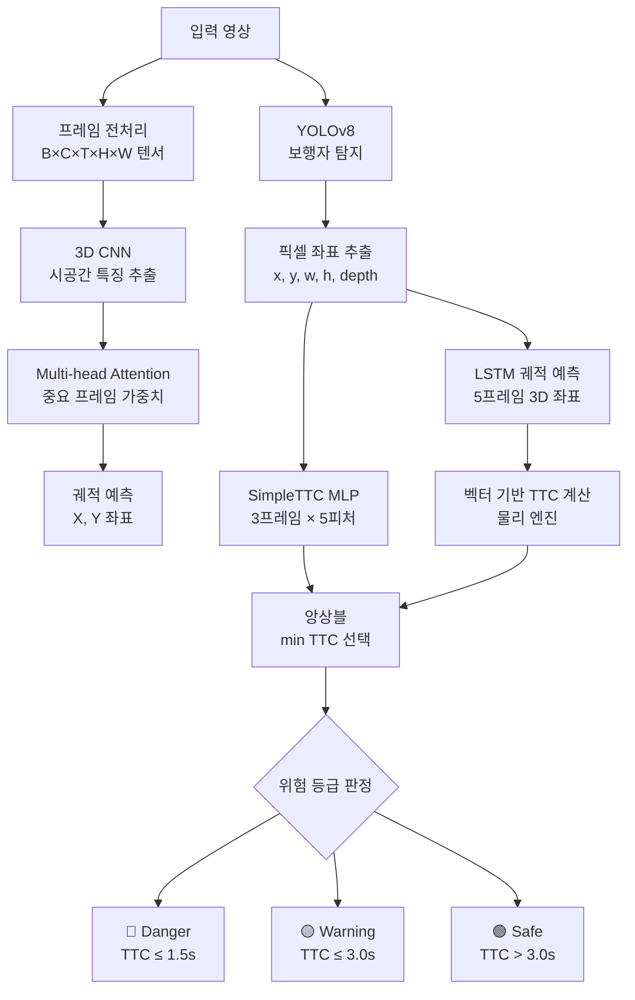
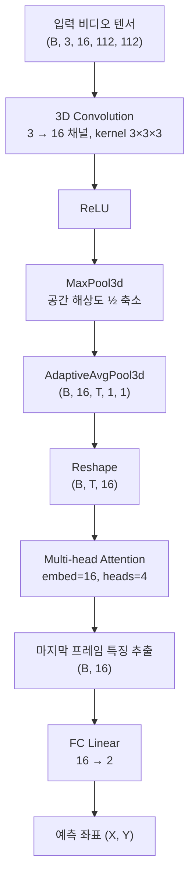
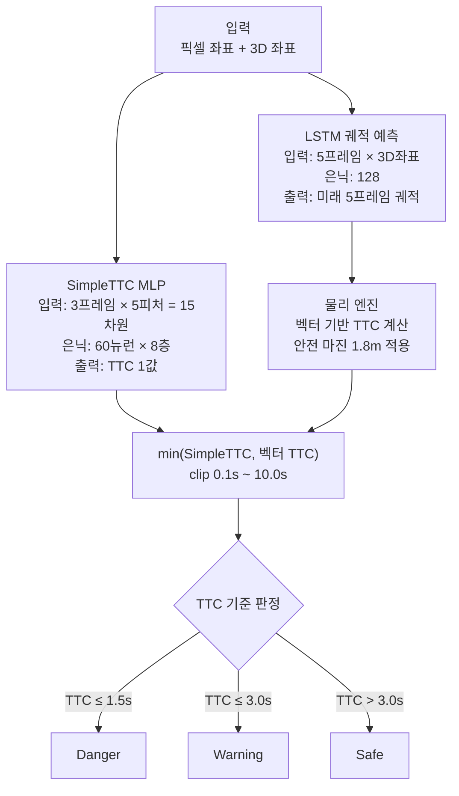

# Pedestrian Trajectory Prediction API

보행자 궤적 예측 및 충돌 위험도(TTC) 분석 API 서버입니다.  
YOLOv8 보행자 탐지, 3D CNN + Attention 모델, LSTM 궤적 예측을 결합한 딥러닝 파이프라인입니다.

## 프로젝트 구조

```
pedestrian_trajectory_api/
├── app/                    # 초기 파이프라인 (3D CNN 기반)
│   ├── main.py             # FastAPI 엔드포인트
│   ├── model.py            # 3D CNN + Attention 모델
│   ├── detector.py         # YOLOv8 보행자 탐지
│   ├── inference.py        # 추론 파이프라인
│   ├── preprocess.py       # 영상 프레임 전처리
│   ├── dataset.py          # 데이터셋 로더
│   └── train.py            # 모델 학습
│
├── src/                    # 고도화 파이프라인 (TTC 예측 기반)
│   ├── main.py             # FastAPI 엔드포인트 (Safe-AI API)
│   ├── inference_engine.py # SimpleTTC + LSTM 통합 추론
│   ├── app_ui.py           # UI 인터페이스
│   ├── predictors/
│   │   ├── simple_ttc.py       # SimpleTTC 모델 (픽셀 기반 TTC 예측)
│   │   ├── lstm_predictor.py   # LSTM 3D 궤적 예측 모델
│   │   └── cnn3d_predictor.py  # 3D CNN 예측 모델
│   ├── utils/
│   │   ├── dataset.py          # 기본 데이터셋 처리
│   │   ├── lstm_dataset.py     # LSTM 학습용 데이터셋
│   │   ├── cnn3d_dataset.py    # 3D CNN 학습용 데이터셋
│   │   ├── kitti_parser.py     # KITTI 데이터셋 파서
│   │   ├── sgan_parser.py      # ETH/UCY 데이터셋 파서
│   │   └── physics_engine.py   # 물리 기반 TTC 계산
│   ├── train_lstm.py           # LSTM 모델 학습
│   ├── train_cnn3d.py          # 3D CNN 모델 학습
│   ├── train_simple_ttc.py     # SimpleTTC 모델 학습
│   └── visualize.py            # 궤적 시각화
│
├── models/                 # 학습된 스케일러 파일
├── Dockerfile
└── requirements.txt
```

## 모델 아키텍처

### 시스템 전체 파이프라인



### 1. 3D CNN + Attention 모델 구조 (app/)



### 2. TTC 앙상블 추론 구조 (src/)



### TTC 위험 등급

| TTC 범위 | 위험 등급 |
|----------|----------|
| ≤ 1.5초 | **Danger** |
| 1.5 ~ 3.0초 | **Warning** |
| > 3.0초 | **Safe** |

## 데이터셋

ETH/UCY 보행자 궤적 공개 데이터셋을 사용합니다.

| 데이터셋 | 설명 |
|---------|------|
| ETH | 취리히 공과대학 캠퍼스 |
| Hotel | 호텔 앞 광장 |
| UNIV | 대학 캠퍼스 |
| ZARA1/2 | 자라 매장 앞 거리 |

## API 엔드포인트

### app/ 서버 (3D CNN 기반)
```bash
uvicorn app.main:app --host 0.0.0.0 --port 8000
```

| 메서드 | 경로 | 설명 |
|--------|------|------|
| GET | `/` | 서버 상태 확인 |
| GET | `/health` | 디바이스 정보 확인 |
| POST | `/predict` | 영상 경로로 궤적 예측 |

```json
// POST /predict
{ "video_path": "data/sample_video.mp4" }

// 응답
{ "status": "success", "predicted_x": 0.1234, "predicted_y": -0.5678 }
```

### src/ 서버 (TTC 기반)
```bash
uvicorn src.main:app --host 0.0.0.0 --port 8888
```

| 메서드 | 경로 | 설명 |
|--------|------|------|
| POST | `/predict` | TTC 및 위험 등급 예측 |

```json
// POST /predict
{
  "history_pix": [[x, y, w, h, depth], ...],  // 최근 3프레임 픽셀 데이터
  "history_3d":  [[x, y, depth], ...]          // 과거 5프레임 3D 좌표
}

// 응답
{ "ttc": 2.45, "status": "Warning" }
```

## 실행 방법

### 로컬 실행
```bash
pip install -r requirements.txt

# app/ 서버
uvicorn app.main:app --reload --port 8000

# src/ 서버
uvicorn src.main:app --reload --port 8888
```

### Docker 실행
```bash
docker build -t trajectory-api .
docker run -p 8000:8000 trajectory-api
```

## 기술 스택

- **언어**: Python 3.x
- **딥러닝**: PyTorch
- **객체 탐지**: YOLOv8 (Ultralytics)
- **API 서버**: FastAPI, Uvicorn
- **데이터 처리**: NumPy, Pandas, scikit-learn, OpenCV
